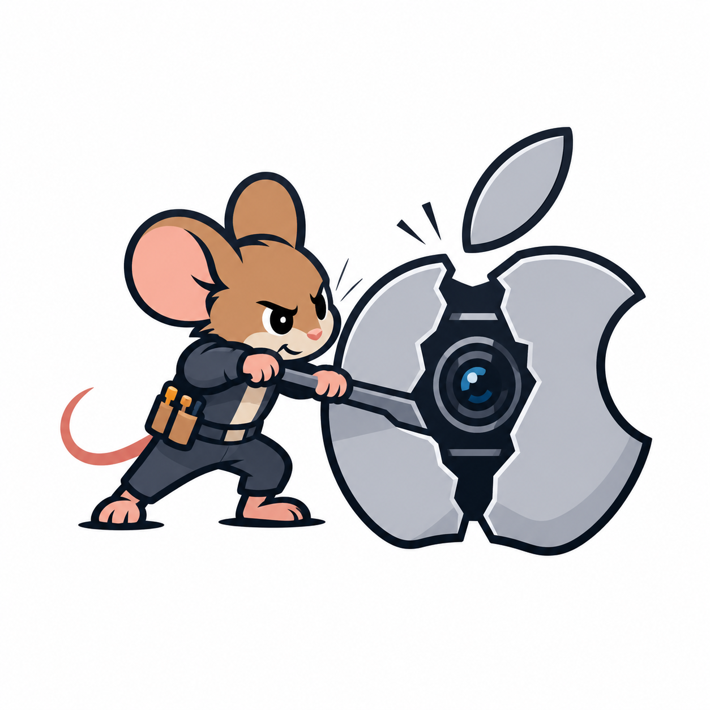

# iPhone Continuity Camera on Linux Research

<p align="center">
  
</p>

Experimental, evidence-first reverse engineering of Apple Continuity Camera, initially using macOS as an oracle. The target is a Linux daemon that uses an unmodified, trusted iPhone and publishes video through GStreamer, PipeWire, or V4L2.

## Quick Start

The offline crypto helpers run on any OS with Python 3.12+ and reproduce the reverse-engineered protocol without any Apple hardware.

Prerequisites: [`uv`](https://docs.astral.sh/uv/) for Python dependency management. `openssl` on `PATH` for the SRTP helper.

```bash
git clone https://github.com/mnsosa/iphone-continuity-linux-research.git
cd iphone-continuity-linux-research
uv sync
uv run python scripts/pair-verify.py self-test
uv run python scripts/rapport-aead.py self-test
uv run python scripts/srtp-aes256.py self-test
```

The macOS-only capture and runtime-analysis scripts (`scripts/*.sh`, `macos-probe/`) require an Apple Silicon Mac with an iPhone signed into the same Apple Account, plus `sudo` for packet capture. They are described under "Reproducing the macOS Capture" below.

## Status

The first controlled experiment is complete. This iPhone is **not** exposed as UVC. macOS uses USB configuration 6 and two CDC-NCM links; Continuity Camera runs on a hidden CDC-NCM link (`en10` on the test machine) as Rapport control sessions plus HEVC over AES-256-CM/HMAC-SHA1-80 SRTP. Rapport RPC uses OPACK dictionaries inside AEAD records with a four-byte authenticated header. The `main` Rapport stream is confirmed to use ChaCha20-Poly1305 (16-byte tag) with per-direction HKDF-SHA512 keys (`ClientEncrypt-main` / `ServerEncrypt-main`, empty salt over the Pair-Verify secret) and independent 96-bit little-endian nonces. The receiving Rapport stream server generates each 32-byte media stream key and sends it in the path-setup response; Continuity Capture combines that key with 14 bytes of the session UUID. See `notes/findings.md` and `notes/protocol.md` for evidence and confidence levels.

## Reproducing the macOS Capture

Run from a Terminal on the Mac so `sudo` and camera permission prompts are visible:

```bash
./scripts/build-probe.sh
./scripts/run-experiment.sh
```

The probe timeline, measured after camera authorization, is:

```text
t=0   probe starts
t=5   AVCaptureDevice discovery
t=10  session configured
t=15  startRunning
t=30  stopRunning
```

Outputs are grouped under `experiments/runs/<timestamp>/`. Packet captures are per-interface so traffic attribution does not depend on assumptions about interface roles.

Private-framework runtime metadata can be regenerated without modifying system files:

```bash
./scripts/dump-private-runtime.sh
```

## Offline Crypto Helpers

Python helpers are managed with `uv` (`pyproject.toml`); run them via `uv run`. Validate the offline AES-256 SRTP key derivation against RFC 6188:

```bash
uv run python scripts/srtp-aes256.py self-test
```

The same helper accepts `derive` and `decrypt-rtp` commands for a future capture containing the unredacted 46-byte master material.

Validate the offline Rapport stream AEAD (HKDF-SHA512 keys, little-endian nonce, ChaCha20-Poly1305 with frame-header AAD):

```bash
uv run python scripts/rapport-aead.py self-test
```

`rapport-aead.py` also accepts `derive`, `encrypt`, and `decrypt` subcommands, keyed from either a raw 32-byte stream key (`--key`) or the Pair-Verify shared secret (`--secret --direction`), with `--frame-aad` to reproduce the four-byte header AAD.

Validate the offline Rapport Pair-Verify crypto (X25519 with HKDF-derived ephemeral key, Pair-Verify encryption key, TLV8 framing, ChaCha20-Poly1305 sub-TLVs, Ed25519 identity signatures):

```bash
uv run python scripts/pair-verify.py self-test
```

See `notes/authentication.md` for the reconstructed M1-M4 flow, TLV types, and KDF labels.

## How To Continue

The transport and crypto layers are reproducible; the open work is the identity blocker and, separately, a practical Linux camera path.

1. Read `notes/` in order: `architecture.md` (map), `usb.md` / `network.md` (transport), `protocol.md` (RPC, framing, SRTP), `authentication.md` (Pair-Verify + the SameAccount identity gate), `findings.md` (evidence log), `prior-art.md` (libimobiledevice, go-ios, pymobiledevice3).
2. Reproduce a capture on your own Mac + iPhone with the scripts above, then diff your `experiments/runs/<timestamp>/` against the documented findings.
3. Extend the offline helpers into a live Linux client: USB mode-switch to expose the hidden CDC-NCM link, `_remoted._tcp` discovery, then drive Pair-Verify with `scripts/pair-verify.py` and the Rapport framing/AEAD from `scripts/rapport-aead.py`.
4. Identity is the hard blocker (see Key Finding). Contributions exploring same-account credential import, or an alternative non-Continuity camera path (e.g. an RTSP/MJPEG source bridged to `v4l2loopback`), are welcome.

Confidence labels (`CONFIRMED`, `HIGH CONFIDENCE`, `LIKELY`, `SPECULATION`, `DISPROVEN`) are used throughout `notes/`; please keep new claims tagged and backed by evidence (method names, addresses, or capture references).

## Safety And Scope

This work targets devices owned and authorized by the researcher. Pairing, trust, Continuity authentication, and session encryption are treated as distinct layers. Findings use the confidence labels in `notes/findings.md`.

## Key Finding

A Linux receiver can reproduce the transport (hidden CDC-NCM link), the Rapport RPC/OPACK layer, the Pair-Verify crypto (X25519 + HKDF-SHA512 + ChaCha20-Poly1305 + Ed25519), the stream AEAD, and the HEVC-over-SRTP media path. The one hard blocker is identity: the iPhone only accepts a peer that proves membership in the same Apple Account, verified via an Apple-issued Apple ID certificate, the account DS ID, and an account validation record (see `notes/authentication.md`). This cannot be forged; a self-generated identity is rejected. Reproducing Continuity Camera on Linux with a stock iPhone therefore requires importing an existing same-account credential, which is out of scope here.

## Local Data

Captured artifacts (`experiments/`, `captures/`, `logs/`, `dumps/private-runtime.txt`) are intentionally not committed: they contain device serial numbers, hostnames, and other personal identifiers, and are regenerable with the scripts in `scripts/`.

## License

MIT. See `LICENSE`.
